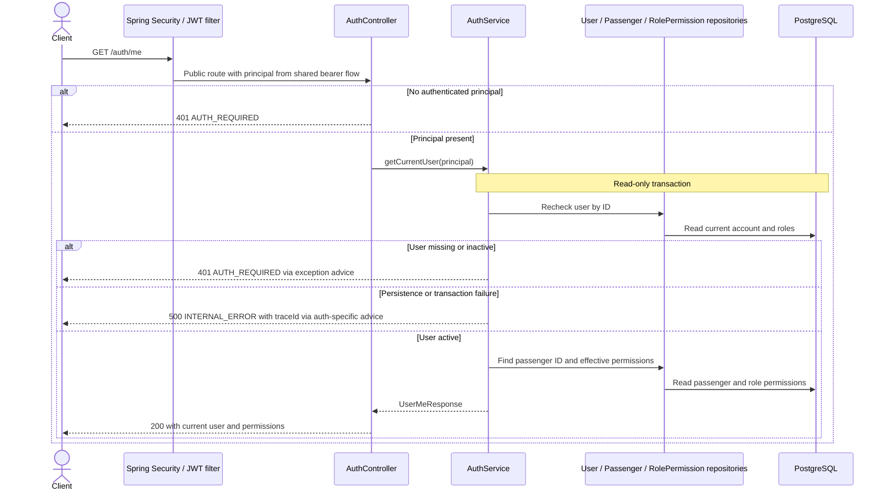

# GET /auth/me

```mermaid
sequenceDiagram
    actor Client
    participant Security as Spring Security / JWT filter
    participant Controller as AuthController
    participant Service as AuthService
    participant Repo as User / Passenger / RolePermission repositories
    participant DB as PostgreSQL

    Client->>Security: GET /auth/me
    Security->>Controller: Public route with principal from shared bearer flow
    alt No authenticated principal
        Controller-->>Client: 401 AUTH_REQUIRED
    else Principal present
        Controller->>Service: getCurrentUser(principal)
        Note over Service,DB: Read-only transaction
        Service->>Repo: Recheck user by ID
        Repo->>DB: Read current account and roles
        alt User missing or inactive
            Service-->>Client: 401 AUTH_REQUIRED via exception advice
        else Persistence or transaction failure
            Service-->>Client: 500 INTERNAL_ERROR with traceId via auth-specific advice
        else User active
            Service->>Repo: Find passenger ID and effective permissions
            Repo->>DB: Read passenger and role permissions
            Service-->>Controller: UserMeResponse
            Controller-->>Client: 200 with current user and permissions
        end
    end
```

The [shared security and error flow](../README.md#shared-security-and-error-flow) covers JWT verification and filter errors before dispatch.
