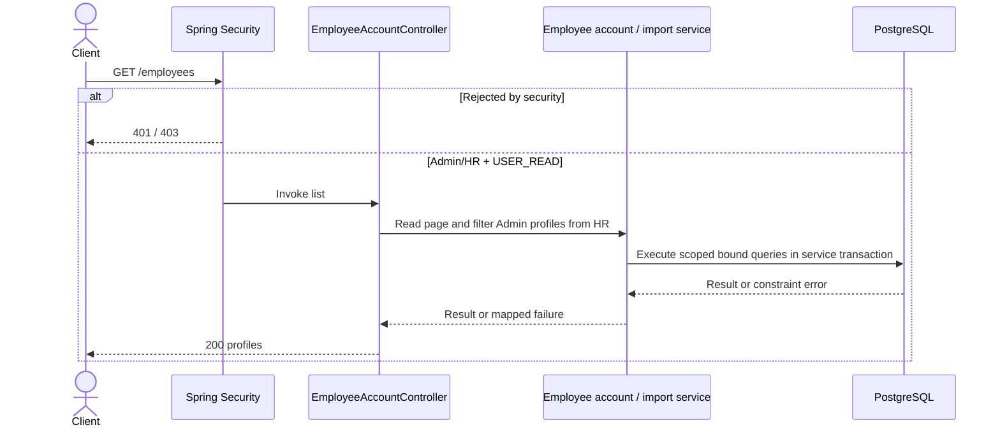

# GET /employees

```mermaid
sequenceDiagram
    actor Client
    participant Security as Spring Security
    participant API as EmployeeAccountController
    participant Service as Employee account / import service
    participant DB as PostgreSQL
    Client->>Security: GET /employees
    alt Rejected by security
        Security-->>Client: 401 / 403
    else Admin/HR + USER_READ
        Security->>API: Invoke list
        API->>Service: Read page and filter Admin profiles from HR
        Service->>DB: Execute scoped bound queries in service transaction
        DB-->>Service: Result or constraint error
        Service-->>API: Result or mapped failure
        API-->>Client: 200 profiles
    end
```

See the [reviewed HR flow](../ITINERARY-PROGRAM-FLOWS.md#tài-khoản-nhân-viên-và-nhập-excel).
