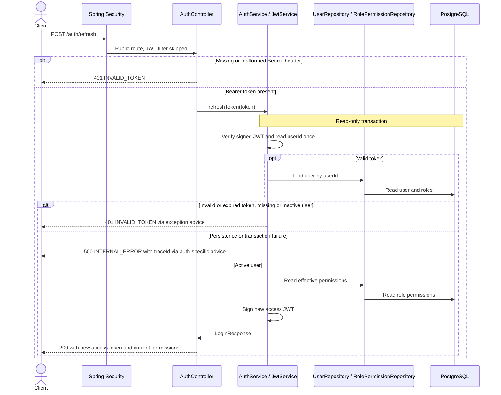

# POST /auth/refresh

```mermaid
sequenceDiagram
    actor Client
    participant Security as Spring Security
    participant Controller as AuthController
    participant Service as AuthService / JwtService
    participant Repo as UserRepository / RolePermissionRepository
    participant DB as PostgreSQL

    Client->>Security: POST /auth/refresh
    Security->>Controller: Public route, JWT filter skipped
    alt Missing or malformed Bearer header
        Controller-->>Client: 401 INVALID_TOKEN
    else Bearer token present
        Controller->>Service: refreshToken(token)
        Note over Service,DB: Read-only transaction
        Service->>Service: Verify signed JWT and read userId once
        opt Valid token
            Service->>Repo: Find user by userId
            Repo->>DB: Read user and roles
        end
        alt Invalid or expired token, missing or inactive user
            Service-->>Client: 401 INVALID_TOKEN via exception advice
        else Persistence or transaction failure
            Service-->>Client: 500 INTERNAL_ERROR with traceId via auth-specific advice
        else Active user
            Service->>Repo: Read effective permissions
            Repo->>DB: Read role permissions
            Service->>Service: Sign new access JWT
            Service-->>Controller: LoginResponse
            Controller-->>Client: 200 with new access token and current permissions
        end
    end
```

Refresh uses an unexpired access token and issues a new access token. See [shared error handling](../README.md#shared-security-and-error-flow).
