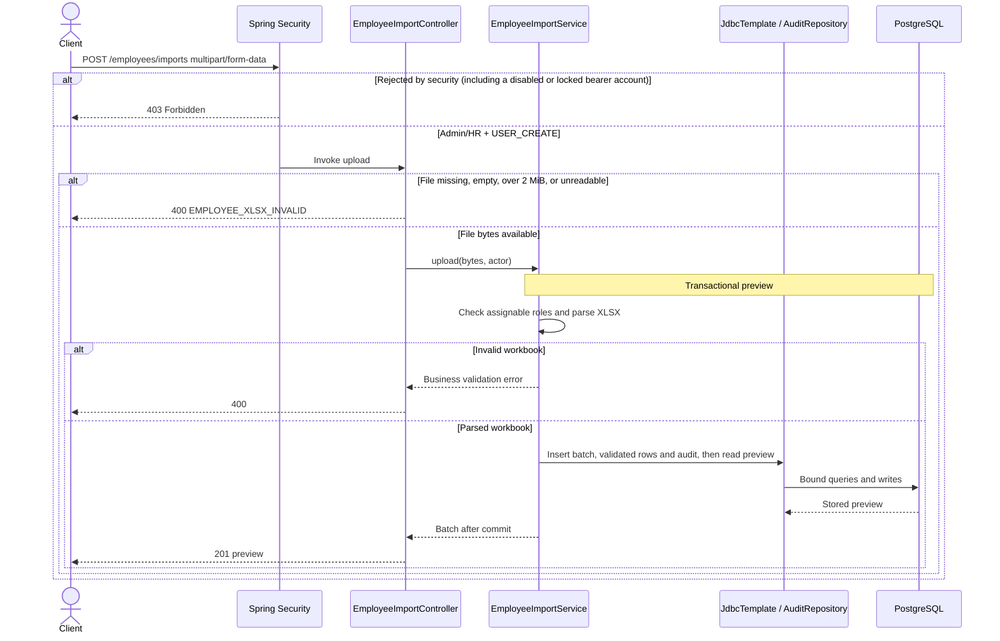

# POST /employees/imports

```mermaid
sequenceDiagram
    actor Client
    participant Security as Spring Security
    participant API as EmployeeImportController
    participant Service as EmployeeImportService
    participant JDBC as JdbcTemplate / AuditRepository
    participant DB as PostgreSQL
    Client->>Security: POST /employees/imports multipart/form-data
    alt Rejected by security (including a disabled or locked bearer account)
        Security-->>Client: 403 Forbidden
    else Admin/HR + USER_CREATE
        Security->>API: Invoke upload
        alt File missing, empty, over 2 MiB, or unreadable
            API-->>Client: 400 EMPLOYEE_XLSX_INVALID
        else File bytes available
            API->>Service: upload(bytes, actor)
            Note over Service,DB: Transactional preview
            Service->>Service: Check assignable roles and parse XLSX
            alt Invalid workbook
                Service-->>API: Business validation error
                API-->>Client: 400
            else Parsed workbook
                Service->>JDBC: Insert batch, validated rows and audit, then read preview
                JDBC->>DB: Bound queries and writes
                DB-->>JDBC: Stored preview
                Service-->>API: Batch after commit
                API-->>Client: 201 preview
            end
        end
    end
```

See the [shared bearer authentication flow](../BEARER-AUTHENTICATION.md) and the [reviewed HR flow](../ITINERARY-PROGRAM-FLOWS.md#tài-khoản-nhân-viên-và-nhập-excel).
