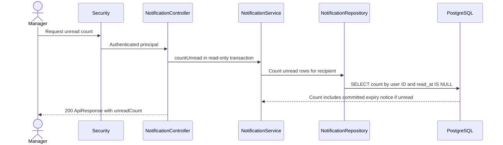

# GET /notification/unread-count

```mermaid
sequenceDiagram
    actor Manager
    participant Security
    participant Controller as NotificationController
    participant Service as NotificationService
    participant Repo as NotificationRepository
    participant DB as PostgreSQL
    Manager->>Security: Request unread count
    Security->>Controller: Authenticated principal
    Controller->>Service: countUnread in read-only transaction
    Service->>Repo: Count unread rows for recipient
    Repo->>DB: SELECT count by user ID and read_at IS NULL
    DB-->>Service: Count includes committed expiry notice if unread
    Controller-->>Manager: 200 ApiResponse with unreadCount
```
