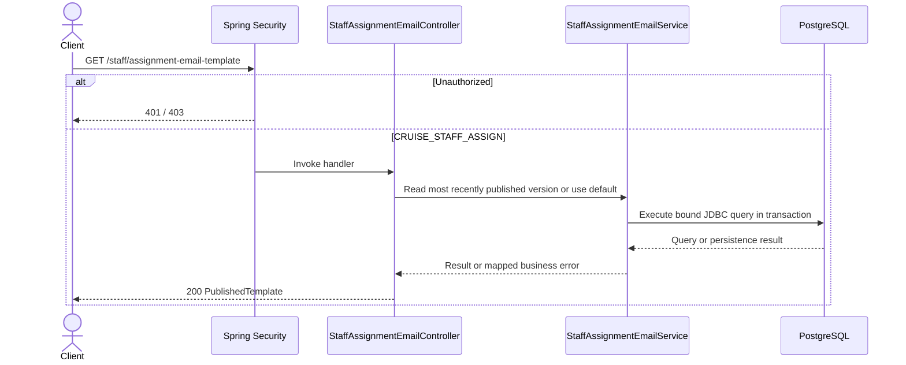

# GET /staff/assignment-email-template

```mermaid
sequenceDiagram
    actor Client
    participant Auth as Spring Security
    participant API as StaffAssignmentEmailController
    participant Service as StaffAssignmentEmailService
    participant DB as PostgreSQL
    Client->>Auth: GET /staff/assignment-email-template
    alt Unauthorized
        Auth-->>Client: 401 / 403
    else CRUISE_STAFF_ASSIGN
        Auth->>API: Invoke handler
        API->>Service: Read most recently published version or use default
        Service->>DB: Execute bound JDBC query in transaction
        DB-->>Service: Query or persistence result
        Service-->>API: Result or mapped business error
        API-->>Client: 200 PublishedTemplate
    end
```

See [email assignment flow](../ITINERARY-PROGRAM-FLOWS.md#email-phân-công-nhân-viên).
