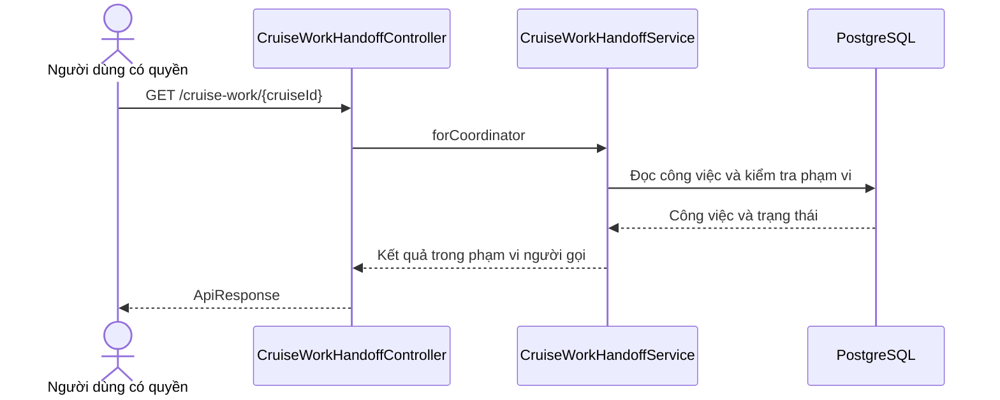

# GET `/cruise-work/{cruiseId}`

Quản lý lịch trình xem tiến độ công việc theo chuyến, gồm bản ghi ASM được tạo từ yêu cầu staffing.

```mermaid
sequenceDiagram
    actor Caller as Người dùng có quyền
    participant API as CruiseWorkHandoffController
    participant Service as CruiseWorkHandoffService
    participant DB as PostgreSQL
    Caller->>API: GET /cruise-work/{cruiseId}
    API->>Service: forCoordinator
    Service->>DB: Đọc công việc và kiểm tra phạm vi
    DB-->>Service: Công việc và trạng thái
    Service-->>API: Kết quả trong phạm vi người gọi
    API-->>Caller: ApiResponse
```

[Xem luồng bàn giao đầy đủ](../SHIP-STAFFING-HANDOFF.md).
