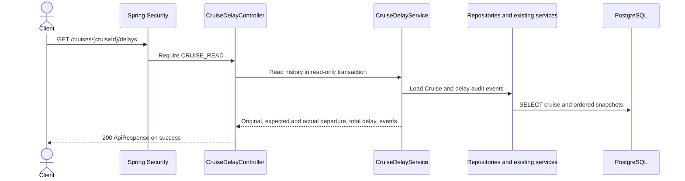

# GET /cruises/{cruiseId}/delays

CRUISE_READ. See [departure and delay flows](../CRUISE-DEPARTURE-DELAY.md).

```mermaid
sequenceDiagram
    actor Client
    participant Auth as Spring Security
    participant C as CruiseDelayController
    participant S as CruiseDelayService
    participant R as Repositories and existing services
    participant DB as PostgreSQL
    Client->>Auth: GET /cruises/{cruiseId}/delays
    Auth->>C: Require CRUISE_READ
    C->>S: Read history in read-only transaction
    S->>R: Load Cruise and delay audit events
    R->>DB: SELECT cruise and ordered snapshots
    S-->>C: Original, expected and actual departure, total delay, events
    C-->>Client: 200 ApiResponse on success
```
