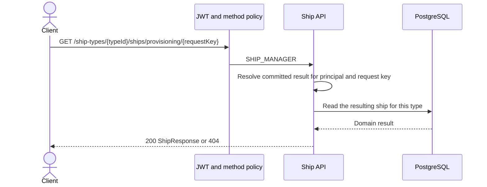

# GET /ship-types/{typeId}/ships/provisioning/{requestKey}

See [the WebAdmin contract](../../ship-redesign/CASMS_SHIP_BE_HANDOFF_FOR_FE.md) for request parameters, response fields, and errors.

```mermaid
sequenceDiagram
    actor Client
    participant Security as JWT and method policy
    participant API as Ship API
    participant DB as PostgreSQL
    Client->>Security: GET /ship-types/{typeId}/ships/provisioning/{requestKey}
    Security->>API: SHIP_MANAGER
    API->>API: Resolve committed result for principal and request key
    API->>DB: Read the resulting ship for this type
    DB-->>API: Domain result
    API-->>Client: 200 ShipResponse or 404
```
