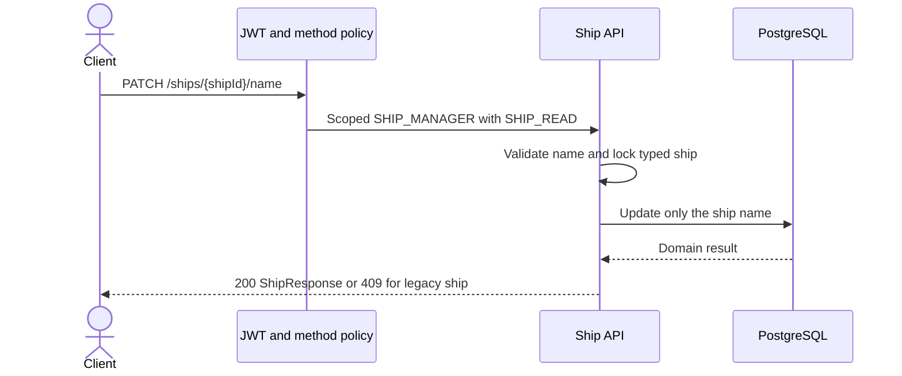

# PATCH /ships/{shipId}/name

See [the WebAdmin contract](../../ship-redesign/CASMS_SHIP_BE_HANDOFF_FOR_FE.md) for request parameters, response fields, and errors.

```mermaid
sequenceDiagram
    actor Client
    participant Security as JWT and method policy
    participant API as Ship API
    participant DB as PostgreSQL
    Client->>Security: PATCH /ships/{shipId}/name
    Security->>API: Scoped SHIP_MANAGER with SHIP_READ
    API->>API: Validate name and lock typed ship
    API->>DB: Update only the ship name
    DB-->>API: Domain result
    API-->>Client: 200 ShipResponse or 409 for legacy ship
```
