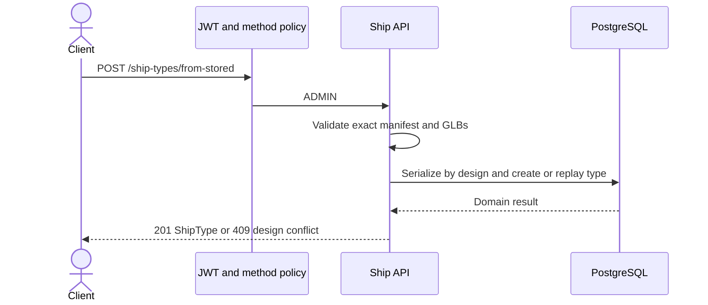

# POST /ship-types/from-stored

See [the WebAdmin contract](../../ship-redesign/CASMS_SHIP_BE_HANDOFF_FOR_FE.md) for request parameters, response fields, and errors.

```mermaid
sequenceDiagram
    actor Client
    participant Security as JWT and method policy
    participant API as Ship API
    participant DB as PostgreSQL
    Client->>Security: POST /ship-types/from-stored
    Security->>API: ADMIN
    API->>API: Validate exact manifest and GLBs
    API->>DB: Serialize by design and create or replay type
    DB-->>API: Domain result
    API-->>Client: 201 ShipType or 409 design conflict
```
