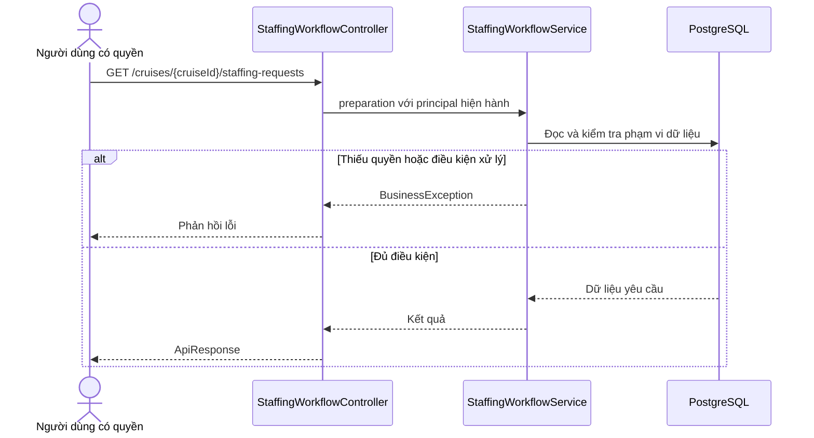

# GET `/cruises/{cruiseId}/staffing-requests`

Đọc revision lịch trình, dịch vụ và yêu cầu hiện có trong phạm vi chuyến.

```mermaid
sequenceDiagram
    actor Caller as Người dùng có quyền
    participant API as StaffingWorkflowController
    participant WF as StaffingWorkflowService
    participant DB as PostgreSQL
    Caller->>API: GET /cruises/{cruiseId}/staffing-requests
    API->>WF: preparation với principal hiện hành
    WF->>DB: Đọc và kiểm tra phạm vi dữ liệu
    alt Thiếu quyền hoặc điều kiện xử lý
        WF-->>API: BusinessException
        API-->>Caller: Phản hồi lỗi
    else Đủ điều kiện
        DB-->>WF: Dữ liệu yêu cầu
        WF-->>API: Kết quả
        API-->>Caller: ApiResponse
    end
```

[Xem đầy đủ các bước bàn giao](../SHIP-STAFFING-HANDOFF.md).
